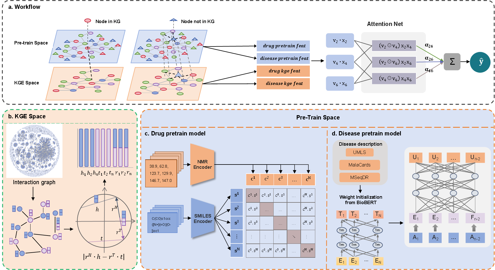

# UKEDR

This repository contains the code for the manuscript titled "A Fused Deep Learning Approach to Transform Novel Drug Repositioning."

Drug repositioning offers a transformative approach to uncovering new therapeutic uses for existing drugs, significantly accelerating drug development, reducing costs, and enhancing efficiency. However, existing methods often struggle with challenges such as managing complex network representations, addressing cold start issues, and leveraging intrinsic attribute representations effectively.

To tackle these limitations, we present UKEDR, a fused deep learning framework that integrates knowledge graph embeddings, advanced pre-training strategies, and recommendation systems to revolutionize drug repositioning. UKEDR introduces a novel semantic similarity-driven embedding approach that combines pre-trained embeddings with knowledge graph structures, specifically designed to address the cold start problem.

## Data Availability
The data used in this study can be downloaded from Google Drive: [Download Here](https://drive.google.com/file/d/1HJtJoflFfMx4pw8S-nCCASPSkXjyKXw-/view?usp=drive_link).
